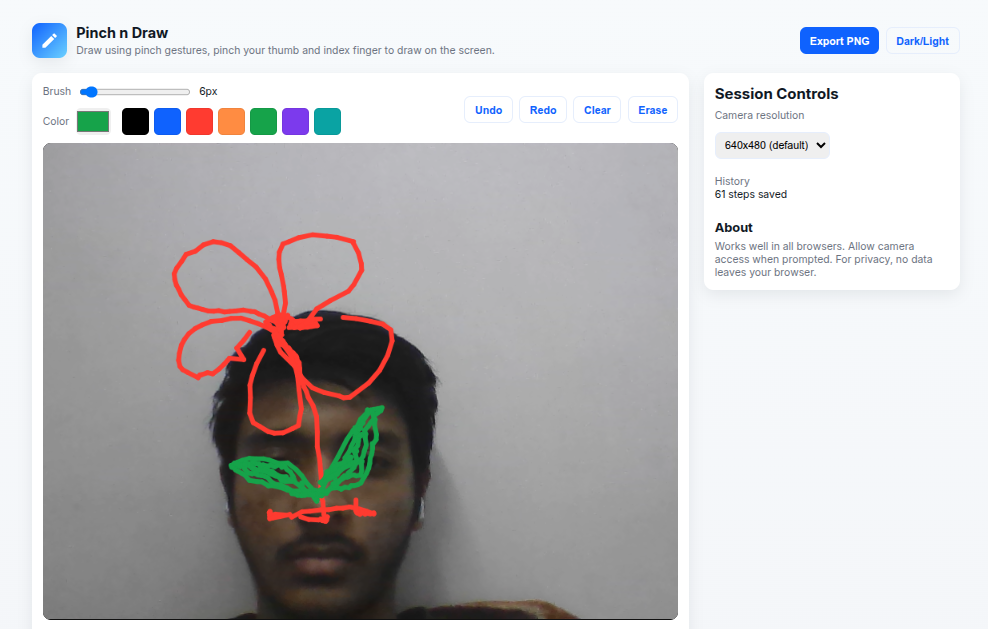

# Pinch n Draw

Draw using pinch gestures, pinch your thumb and index finger to draw on the screen. Export your drawings as images.

## Features

- Freehand drawing on canvas
- Clear canvas button
- Adjustable brush color and size

## Usage

1. Open `index.html` in your browser.
2. Select brush color and size.
3. Draw on the canvas.
4. Click "Clear" to reset the canvas.

## Requirements

- Modern web browser (Chrome, Firefox, Edge, etc.)

## Contributing

Contributions are welcome! Please fork the repository and submit a pull request.